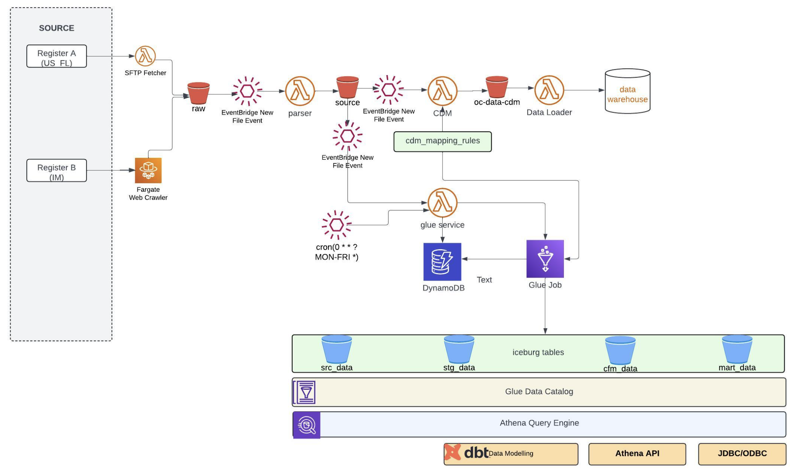
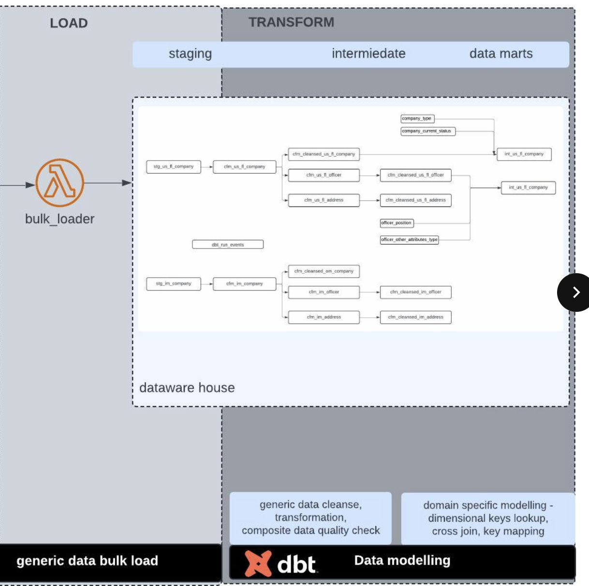

# Data ETL Pipeline

A comprehensive data ETL (Extract, Transform, Load) pipeline built on AWS services for processing structured data from various jurisdictions. The pipeline supports ingestion from SFTP sources, parsing of fixed-width text files, schema transformation to Common Data Model (CDM), and loading to data warehouses.

## Architecture Overview

The pipeline consists of multiple AWS Lambda functions, ECS tasks, and AWS Glue jobs that work together to process data through the following stages:

1. **Ingestion**: Download data from SFTP sources
2. **Parsing**: Convert fixed-width text files to CSV format
3. **Transformation**: Apply schema transformations to CDM format
4. **Loading**: Load transformed data to data warehouse using Apache Iceberg tables

 

 

The pipeline also includes:
- CloudWatch logging for all Lambda functions
- DynamoDB job queues for tracking processing status
- S3 event triggers for automated processing
- Error handling and retry mechanisms


## Components

### Lambda Functions

#### `ingestion_services_handler`
Manages raw data ingestion from SFTP sources and orchestrates the fetching process.

**Triggers:**
- EventBridge scheduled events
- Manual invocation

**Test Cases:**
```json
// Add workload
{
  "action": "ADD_WORKLOAD"
}

// Start fetching job
{
  "action": "START"
}
```

#### `fetcher_ftp_download_handler`
Downloads files from SFTP servers for daily datasets. Larger datasets are processed via ECS tasks.
(jurisdiction example: `us_fl` - "Florida" )
**Test Case:**
```json
{
  "jurisdiction": "us_fl",
  "source_path": "us_fl",
  "target_path": "us_fl", 
  "file_pattern": ".txt",
  "content_type": "text/plain"
}
```

#### `fixed_width_text_handler`
Parses fixed-width text files into CSV format in the source bucket.

**Test Cases:**
```json
// Process new file
{
  "bucket": "jingyel-data-etl-raw",
  "key": "us_fl/2024/10/15/20241015c.txt"
}

// Reload all files
{
  "bucket": "jingyel-data-etl-raw",
  "jurisdiction": "us_fl",
  "action": "reload"
}
```

#### `schema_transformation_handler`
Transforms source data to Common Data Model (CDM) format using jurisdiction-specific mapping rules.

**Test Case:**
```json
{
  "bucket": "jingyel-data-etl-source",
  "key": "us_fl/2024/10/17/us_fl_source.csv"
}
```

#### `glue_services_handler`
Manages AWS Glue jobs for transforming data from source bucket to data lake with Iceberg tables.

**Test Cases:**
```json
// Add workload
{
  "action": "ADD_WORKLOAD",
  "bucket": "jingyel-data-etl-cdm",
  "key": "us_fl/2024/11/6/us_fl_cdm_source.csv",
  "stage": "staging",
  "status": "NEW"
}

// Start glue job
{
  "action": "START"
}

// Reset job queue
{
  "action": "RESET"
}
```

#### `data_bulk_load_handler`
Bulk loads CDM data to the data warehouse.

**Test Case:**
```json
{
  "bucket": "jingyel-data-etl-cdm",
  "key": "us_fl/2024/11/6/us_fl_cdm_source.csv"
}
```

#### `ecs_task_handler`
Creates ECS Fargate tasks to run any lambda function handler for large file processing.

**Test Cases:**
```json
// SFTP download for quarterly data
{
  "ecs_cluster": "jingyel-data-etl-cluster",
  "ecs_task_definition_name": "jingyel-ecs-data-etl",
  "ecs_container": "data_etl",
  "module": "fetcher_ftp_download_handler",
  "payload": "{\"jurisdiction\": \"us_fl\", \"object_key\": \"data.zip\", \"periodicity\": \"quarterly\"}"
}

// Unzip large files
{
  "ecs_cluster": "djingyel-data-etl-cluster",
  "ecs_task_definition_name": "jingyel-ecs-data-etl", 
  "ecs_container": "data_etl",
  "module": "archive_utility_handler",
  "payload": "{\"action\": \"unzip\", \"bucket\": \"data-raw\", \"object_keys\": \"us_fl/data.zip\"}"
}
```

#### `archive_utility_handler`
Handles compression and decompression of archive files.

**Test Case:**
```json
{
  "action": "unzip",
  "bucket": "jingyel-data-etl-raw",
  "object_keys": "us_fl_historical/2024/10/08/cordata.zip"
}
```

### `backfill_file_meta_handler`
Backfills metadata for files in the raw data bucket, ensuring all files have the necessary metadata for processing.
**Test Case:**
```json
{
  "ecs_cluster": "jingyel-data-etl-cluster",
  "ecs_task_definition_name": "jingyel-ecs-data-etl",
  "ecs_container": "data_etl",
  "module": "backfill_file_meta_handler",
  "payload": "{\"bucket\": \"jingyel-data-etl-raw\", \"jurisdiction\": \"us_fl\"}"
}
```
### `csv_chunking_handler`
Splits large CSV files into smaller chunks for easier processing and loading.
**Features:**
- Reads CSV files from S3 and preserves original metadata
- Creates multiple chunk sizes for performance testing and optimization
- Maintains original file structure and column headers
- Uploads chunks to the same S3 bucket with descriptive naming

**Chunk Sizes:**
The handler creates chunks with the following row counts:
- 1,000 rows
- 2,000 rows  
- 5,000 rows
- 10,000 rows
- 20,000 rows
- 50,000 rows
- 100,000 rows
- 200,000 rows
- 500,000 rows
- 1,000,000 rows

**Test Case:**
```json
{
  "bucket": "jingyel-data-etl-source",
  "key": "us_fl_historical/2024/10/8/us_fl_historical_2024_10_08_source_cordata0.csv"
}
```

**Output Files:**
For an input file `us_fl_source.csv`, the handler generates:
- `us_fl_source_1000.csv` (first 1,000 rows)
- `us_fl_source_2000.csv` (first 2,000 rows)
- `us_fl_source_5000.csv` (first 5,000 rows)


### `ecs_wrapper`
A wrapper script that enables Lambda functions to run as ECS Fargate tasks. This allows for processing of large datasets that exceed Lambda's memory and execution time limits.

**Purpose:**
- Executes any Lambda handler function within an ECS container environment
- Provides scalable processing for large files and long-running operations
- Maintains consistent logging output to CloudWatch via stdout streaming
- Dynamically imports and executes specified modules and functions

**Features:**
- **Dynamic Module Loading**: Imports any handler module at runtime
- **Structured Logging**: Configures CloudWatch-compatible logging with timestamps
- **Error Handling**: Comprehensive error reporting with context information
- **Flexible Execution**: Supports any Lambda function signature

**Usage:**
The wrapper is called from within ECS containers with command-line arguments:

```bash
python ecs_wrapper.py --event '{"key": "value"}' --module "handler_module" --function "lambda_handler"
```

**Arguments:**
- `--event`: JSON string containing the event payload for the Lambda function
- `--module`: Python module name containing the handler function
- `--function`: Function name to execute (typically "lambda_handler")

**Example ECS Task Invocations:**

```json
// Run SFTP download as ECS task
{
  "ecs_cluster": "jingyel-data-etl-cluster",
  "ecs_task_definition_name": "jingyel-ecs-data-etl",
  "ecs_container": "data_etl",
  "module": "fetcher_ftp_download_handler",
  "payload": "{\"jurisdiction\": \"us_fl\", \"periodicity\": \"quarterly\"}"
}

// Run file unzipping as ECS task
{
  "ecs_cluster": "jingyel-data-etl-cluster", 
  "ecs_task_definition_name": "jingyel-ecs-data-etl",
  "ecs_container": "data_etl",
  "module": "archive_utility_handler", 
  "payload": "{\"action\": \"unzip\", \"bucket\": \"jingyel-data-etl-raw\", \"object_keys\": \"us_fl/data.zip\"}"
}
```

**Container Configuration:**
- Uses stdout streaming for CloudWatch log integration
- Maintains current working directory context
- Provides detailed error information including module paths and directory listings
- Compatible with Fargate task definitions

**Error Reporting:**
When errors occur, the wrapper logs:
- Exception details and stack trace
- Module and function names being executed
- Event payload content
- Current working directory
- Directory listing for debugging

**Integration:**
The wrapper is used by the `ecs_task_handler` Lambda function to create Fargate tasks that can process large datasets without Lambda's resource constraints.

### AWS Glue Jobs

#### `data_load.py`
Main Glue job for loading data to Iceberg tables in the data lake.

#### `schema_transformation.py` 
Glue job for applying schema transformations and data quality validations.

### Core Modules

#### `shared/`
- **dynamodb.py**: DynamoDB operations for job queues
- **utils.py**: Common utility functions
- **param_models.py**: Pydantic models for data validation
- **constants.py**: Application constants
- **ecs_service.py**: ECS task management

#### `raw_parsers/`
- **fixed_width_txt.py**: Parser for fixed-width text files

#### `schema_transformation/`
- **cdm_mapper.py**: Core CDM mapping logic
- **cdm_mapping_rule.py**: Mapping rule definitions

#### `glue_services/`
AWS Glue service management modules for jobs, crawlers, and workflows.

#### `source_ingestion/`
SFTP and other source ingestion utilities.

## Environment Setup

### Prerequisites
- Python 3.12+
- Poetry for dependency management
- AWS CLI configured
- Docker for containerization

### Installation

```bash
# Install dependencies
poetry install

# Install development dependencies
poetry install --with dev

# Install database dependencies
poetry install --with db

# Install ingestion dependencies  
poetry install --with ingest
```

### Environment Variables

```bash
# AWS Configuration
AWS_REGION=us-east-1
AWS_MANAGEMENT_ID=<aws-access-key>
AWS_MANAGEMENT_KEY=<aws-secret-key>

# S3 Buckets
RAW_DATA_BUCKET=jingyel-data-etl-raw
SOURCE_DATA_BUCKET=jingyel-data-etl-source
CDM_DATA_BUCKET=jingyel-data-etl-cdm
CONFIG_BUCKET=jingyel-data-etl-config

# DynamoDB
DYNAMO_TABLE=etl-job-queue

# ECS Configuration
ECS_CLUSTER=jingyel-data-etl-cluster
ECS_TASK_DEFINITION=data-pipeline-ecs_data_etl
ECS_CONTAINER=data_etl
```

## Testing

Run the test suite:

```bash
poetry run pytest tests/
```

Test specific modules:

```bash
# Test CDM mapper
poetry run pytest tests/test_cdm_mapper.py

# Test fixed-width parser
poetry run pytest tests/test_parser_fixed_width_txt.py

# Test utilities
poetry run pytest tests/test_utils.py
```

### Local Testing

Use the test runner for local lambda function testing:

```bash
python tests/run_lambda.py --operation fetch --jurisdiction us_fl
python tests/run_lambda.py --operation parse-fwtxt --bucket data-raw --object_key us_fl/data.txt
python tests/run_lambda.py --operation map --bucket data-source --object_key us_fl/data.csv
```

## Deployment

### Docker Build

The project uses multi-stage Docker builds for different components:

```bash
# Build all images
docker build --target ingestion_services -t data-etl:ingestion .
docker build --target fixed_width_txt -t data-etl:parser .
docker build --target cdm_mapper -t data-etl:transformer .
```

### CI/CD

GitHub Actions workflows are provided for:
- Docker image builds and ECR deployment
- Pre-commit hooks and code quality checks
- Automated testing

## Data Flow

1. **Ingestion**: SFTP sources → Raw Data Bucket (S3)
2. **Parsing**: Raw Data → Source Data Bucket (CSV format)
3. **Transformation**: Source Data → CDM Data Bucket (standardized format)
4. **Loading**: CDM Data → Data Warehouse (Iceberg tables via Glue)

